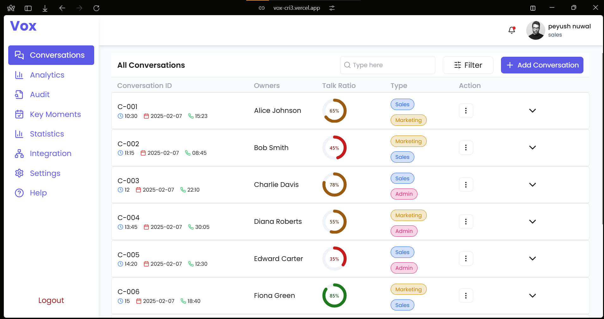
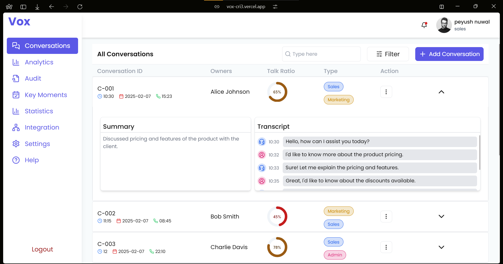
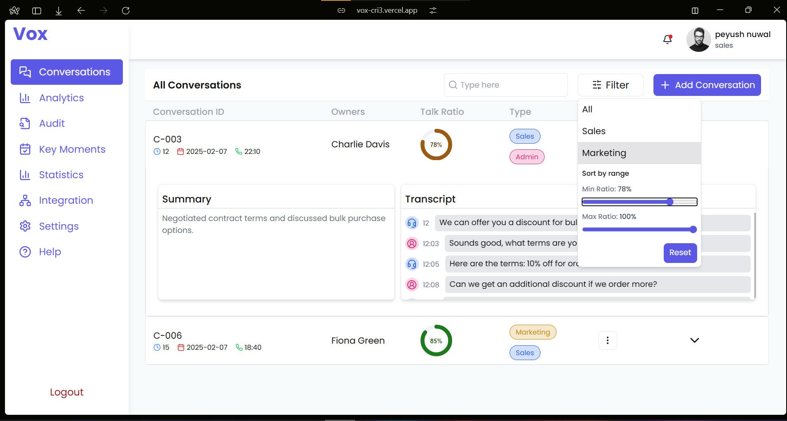

# VOX Gauge - Call Center Analytics Dashboard

A simplified call center analytics dashboard focusing on the Conversations List View, built using Next.js, Lucide Icons, Framer Motion, MUI, Tailwind CSS. The dashboard provides a structured list of conversations with filtering and search functionality.

## Features
- Conversations List View with key details.
- Search Bar to filter conversations by ID or owner.
- Filter by Type (Sales/Marketing).
- Filter by Talk Ratio Range
- Expandable Rows for conversation summaries
- State Management for UI, filters, and data

## Screenshots

1. **Calendar View**  
   Displays the structured list of conversations with search and filtering options.

   

2. **Expanded Conversation Row**  
   Shows additional details when a row is expanded.

   

3. **Filter Menu**  
   Allows filtering conversations by type and talk ratio range.

   


## Live Demo

You can view a live version of the Event Management Application by clicking the link below:

[Live Demo](https://vox-cri3.vercel.app/)


## Installation

### 1. Clone the repository
First, clone the repository to your local machine.

```bash
https://github.com/peyush-nuwal/vox.git
```


### 2. Install dependencies
Navigate to the project directory and install the required dependencies.

```bash
cd event-manager
npm install
```

### 3. Set up your local environment
Make sure you have Node.js installed on your local machine. You can check if Node.js is installed by running:

```bash
node -v

```


###4. Run the application locally
To start the development server, run the following command:

```bash
npm run dev


```


### 5. Build and deploy
To build the application for production, run the following command:

```bash

npm run build
```
